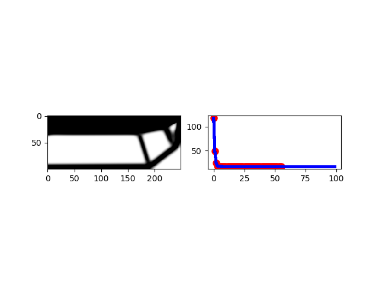
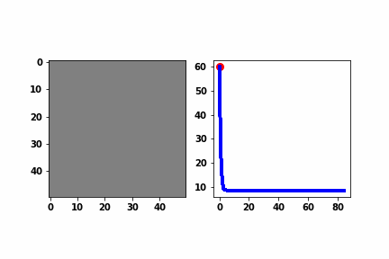
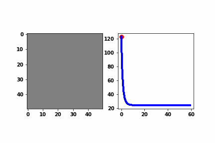
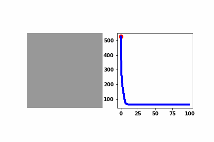

[](https://gitpod.io/#https://github.com/dbetteb/TOP_OPT)

# Object-Oriented Version of 99 lines Topology Optimization



## General

Object-oriented and `numba` optimized version of "99 lines Topology optimization in Matlab"
Python version. Main objective is simply is to enhance numerical experiments when changing
topology optimization parameters and boundary condition and load cases.

Object-oriented version allows to force seamlessly changes in topology optimization settings and
`numba` allows to speed up computations. 

## Example 1: Design Generation with one load

```python
from SetTopol import TopolSettings  
```

This imports all necessary classes and modules to set and launch a new topology optimization

```python
top = TopolSettings()
top.optimize()
```
This launch a topology optimization with default values as in the original version from

You should see in the terminal :

```python
In [3]: top.optimize()
it.: 1 , obj.: 59.825 Vol.: 0.500, ch.: 0.200
it.: 2 , obj.: 24.137 Vol.: 0.500, ch.: 0.200
...
it.: 84 , obj.: 8.464 Vol.: 0.500, ch.: 0.001
it.: 85 , obj.: 8.464 Vol.: 0.500, ch.: 0.001
Elapsed time : 4.980943202972412 s

```

If you need to plot the evolution of the optimization then, you need to specify `store=True`

```python
top.optimize(store=True)
```

This will store all density values for the whole optimization and allow to plot a animation of the optimization and the optimization objective at once.

To save the evolution of design generation and of its objective function (here compliance), you need to call `plot` function and specify the `name` of the **.gif** animation
```python
[In 5]: top.plot(name='example')
Saving Animation ... 
```


To save only the final design, you need to call `save_design` function with a `name` to the **.png** design image
```python
top.save_design(name='example')
Saving design ... 
```

## Features

OO version allow to seamlessy force change in dependent parameters. Typically when changing `nx` (number of elements in `x` direction), `ndofs` (number of degrees of freedom) change as well. To see it :

```python
In [7]: top
Out[7]:
Topology optimization
   50 elements in x_direction, 50 elements in y direction
   5202 total number of degrees of freedom   0.5 of total volume allowed
   5.4 radius filter
```

and try to change `nx` (number of elements in the `x` direction)

```python
In [8]: top.nx = 100
Caution this will change number of dofs and hence
 the optimization problem

In [9]: top
Out[9]:
Topology optimization
   100 elements in x_direction, 50 elements in y direction
   10302 total number of degrees of freedom   0.5 of total volume allowed
   5.4 radius filter
```

now let us reset nx to 50 and try to change the load node, then, re-run the optimization and save the new design

```python
top.setf(value=1, node=51*51-1, teta=270)
top.optimize(store=True)
top.plot(name="example2")
Out[10]:
it.: 1 , obj.: 122.849 Vol.: 0.500, ch.: 0.200
it.: 2 , obj.: 67.225 Vol.: 0.500, ch.: 0.200
it.: 3 , obj.: 44.583 Vol.: 0.500, ch.: 0.200
...
it.: 60 , obj.: 23.910 Vol.: 0.500, ch.: 0.001
Elapsed time : 8.248879671096802 s
Saving Animation ... 
```


## Example 2: Design Generation with multiple loads

This design is fixed from the left side and loaded with 2 loads of $1N$ each: one upward in the top-righ corner, one downward in the bottom-left corner 
**top-right corner load:** \( top.nx \times (top.ny+1) \)  + upward direction => angle = 90
**bottom-left corner load:** \( (top.nx+1) \times (top.ny+1)-1 \) + downward direction  => angle = 180+90

its dimension is $100 \times 100$
```python
from SetTopol_multiple_loads import TopolSettings
import numpy as np
top = TopolSettings(nx = 100, ny = 100, nbr_loads=2, vol = 0.4, rmin = 1.2, penalinit = 3.0, penalmed = 3.0, filt = 0, nu=0.3)
top.fixed= np.arange(0, top.ny+1).tolist()
top.setf(values=[1,1], nodes=[(top.nx+1)*(top.ny+1)-1, top.nx*(top.ny+1) ], tetas=[180+90, 90])
top.optimize(store=True)
top.plot(name="example3")
```


## Requirements

Python > 3.6

numba

matplotlib

numpy
